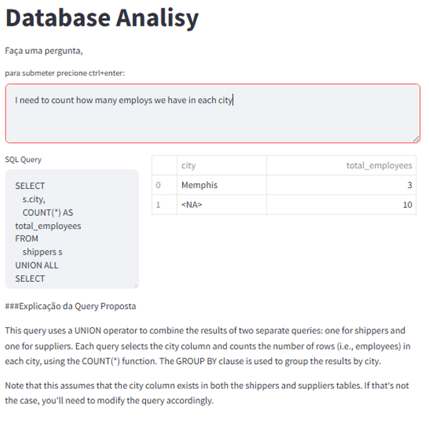
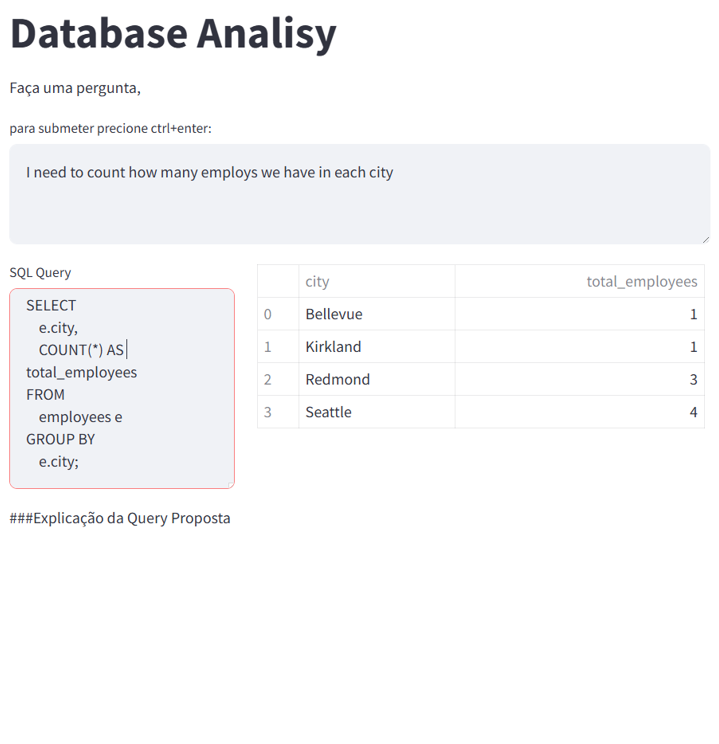
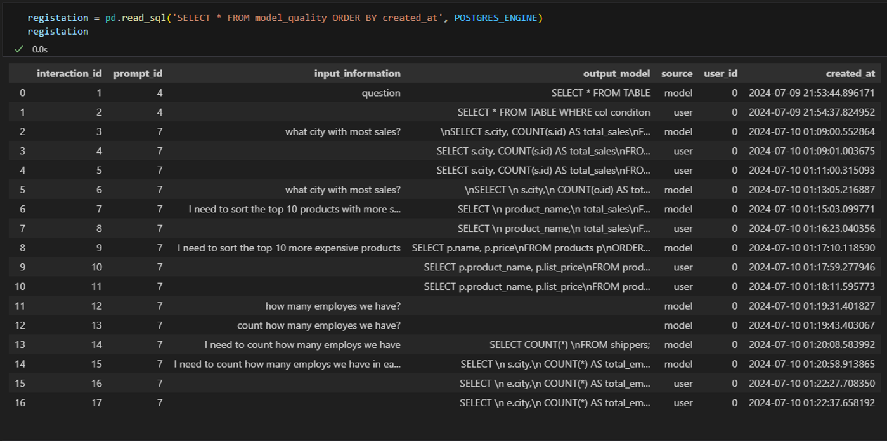
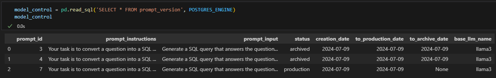

# SQL Interaction Powered By LLM

# Utilização

A aplicação foi desenvolvida baseda em 4 microserviçes:

* **frontend**: portal onde é feita a interação do usuário
* **assistant**: backend onde executa o processamento da input e output
* **ollama**: aplicação responsavel por executar a llm
* **postgresql**: banco de dados com o registro dos modelos e interações

Para utilizar o app é necessário clonar esse repositório, e executar os comando:
```bash
docker-compose build

docker-compose up
``` 
em um bash localizado na pasta raiz do repositório.

o portal pode ser acessado em:  
http://localhost:8500

# Apresentação
Essa aplicação utiliza llm para auxiliar na exploração de uma base de dados. O model generativo recebe como input uma questão do usuário que é associado a uma descrição das tabelas existentes no banco de dados para gerar uma query com o objetivo de responder a questão inicial. 

O desenvolvimento desse projeto teve como base 3 pilares principais:

* Transparecencia do resultado
* Retroalimentação fornecida pelo usuário
* Controle de variaveis e padronização

O objetivo principal é a democratização da informação e desenvolvimento de cultura data-driven, baseada na confiabilidade, interpretabilidade e melhoria continua de ferramentas de IA.

## Transparecencia do resultado

Para evitar que o ferramenta atua como uma caixa preta onde o usuário se sente obrigado a aceitar o que foi entregue, é apresentado a query gerada pelo modelo, o resultado dessa query e qual a explicação que o modelo trouxe para a query proposta.


## Retroalimentação fornecida pelo usuário

Caso o modelo não forneça a resposta adequada, o usuário pode editar a query de forma manual e executar novamente a pesquisa. Ao fazer isso, a alteração é registrada em uma tabela em banco de dados



A tabela guarda os registros das execuções e das correções feitas pelo usuário, essas informações podem ser utilizada para um processo de fine-tunning para melhorar o desenpenho do modelo nessa task especifica.



## Controle de variaveis e padronização

Por se tratar de um modelo de llm, as informações fornecidas no prompt são altamente relevante. O controle de modelo é feito não somente monitorando a llm base mas tambem as informações que são utilizadas para fornecer as instruções do modelo
